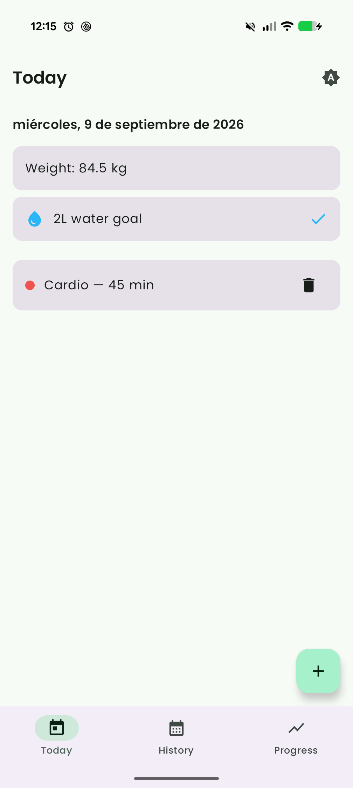
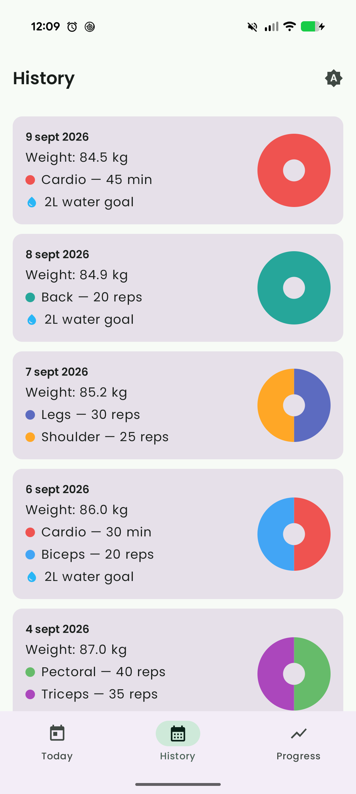
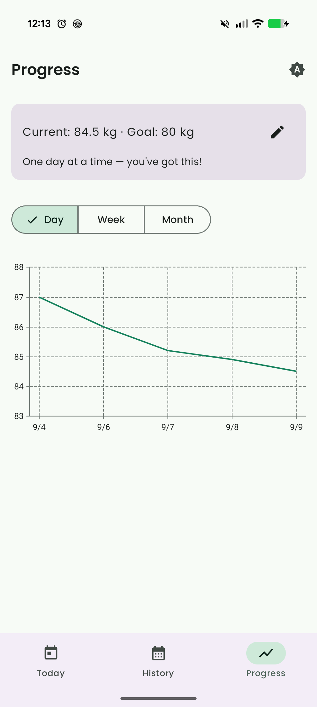
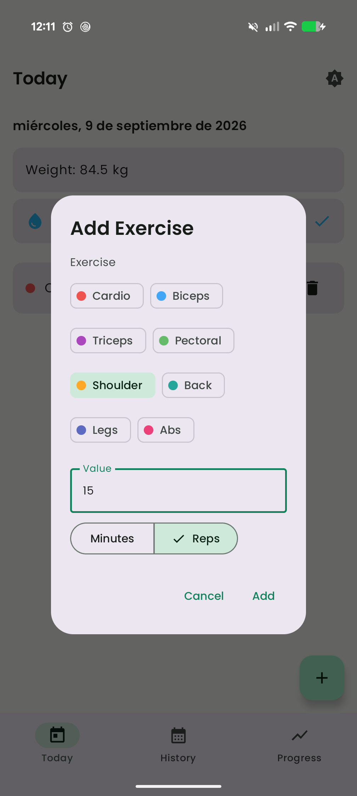
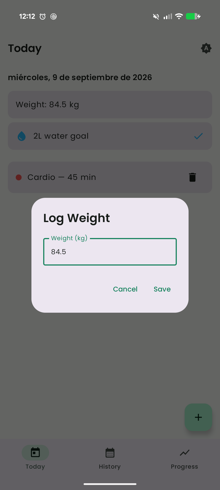
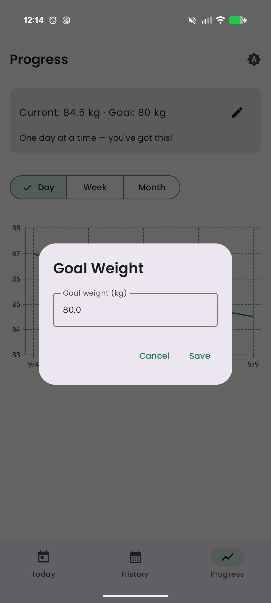
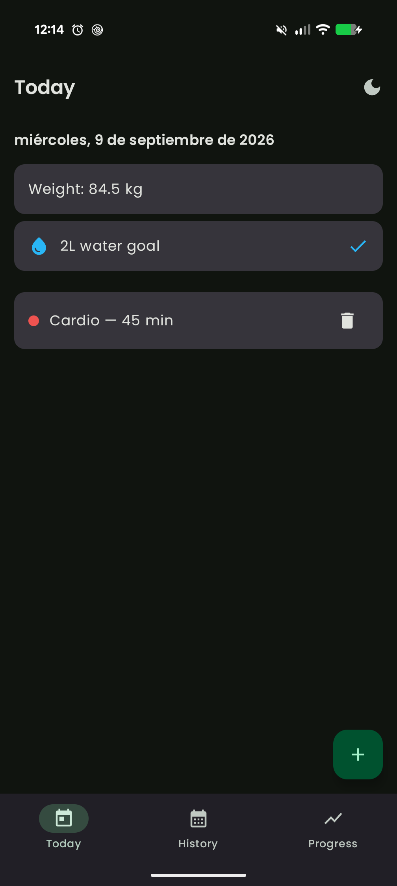

# GymTracker

A simple, fast Android app for logging daily workouts and body weight, and watching your progress over time — built entirely with Kotlin and Jetpack Compose.

## Screenshots

| Today | History | Progress |
| --- | --- | --- |
|  |  |  |

| Add Exercise | Log Weight | Goal Weight |
| --- | --- | --- |
|  |  |  |

| Dark theme |
| --- |
|  |

## Features

- **Today** — see today's date, your logged body weight, your daily hydration checkmark, and every exercise you've logged so far, with the ability to delete an entry.
- **Add Exercise** — log an exercise against one of eight categories (Cardio, Biceps, Triceps, Pectoral, Shoulder, Back, Legs, Abs), tracked in minutes or reps.
- **Log Weight** — record your body weight for the day in kilograms.
- **Hydration** — a one-tap "2L water goal" checkmark for the day, shown with a water-drop icon (kept separate from the exercise breakdown) and carried into History.
- **History** — a day-by-day timeline of every past workout, weight entry, and hydration checkmark, with a per-day donut chart breaking down that day's exercises by category.
- **Progress** — a line chart of your body weight over time (Day / Week / Month granularity), plus an optional goal weight compared against your most recent logged weight with a rotating motivational message until you reach it.
- **Theming** — cycle between System, Light, and Dark appearance from the top app bar.

## Tech stack

- **Kotlin** with 100% **Jetpack Compose** (Material 3) — no XML layouts.
- **Clean Architecture**: `data` / `domain` / `presentation` layers, with use cases mediating between ViewModels and repositories.
- **Koin** for dependency injection.
- **Room** for local persistence (exercises, weight, hydration).
- **SharedPreferences** for lightweight single-value settings (theme mode, goal weight).
- **Navigation Compose** for the Today / History / Progress bottom-navigation flow.
- **Vico** for the body-weight progress chart; a small custom **Compose `Canvas`** donut chart for the per-day exercise category breakdown.
- **Kotlin Coroutines & Flow** throughout the data layer.

## Project structure

```
app/src/main/java/com/mutissx/gymtracker/
├── data/            # Room entities, DAOs, mappers, repository implementations
├── domain/          # Domain models, repository interfaces, use cases
├── presentation/    # Screens, ViewModels, UI state, navigation
├── di/              # Koin modules
└── ui/theme/        # Compose Material 3 theme
```

Each feature (Today, History, Progress) follows the same shape: a `Screen` composable, a `ViewModel` exposing a `StateFlow<UiState>`, and one or more use cases in `domain/usecase` that the ViewModel depends on.

## Getting started

**Requirements:** JDK 17, Android Studio (or the command line with the Gradle wrapper), and a device or emulator running API 30+.

```bash
git clone <this-repository>
cd GymTracker
./gradlew installDebug   # builds and installs the debug build on a connected device/emulator
```

Or simply open the project in Android Studio and run the `app` configuration.

## License

This project is licensed under the [MIT License](LICENSE).
